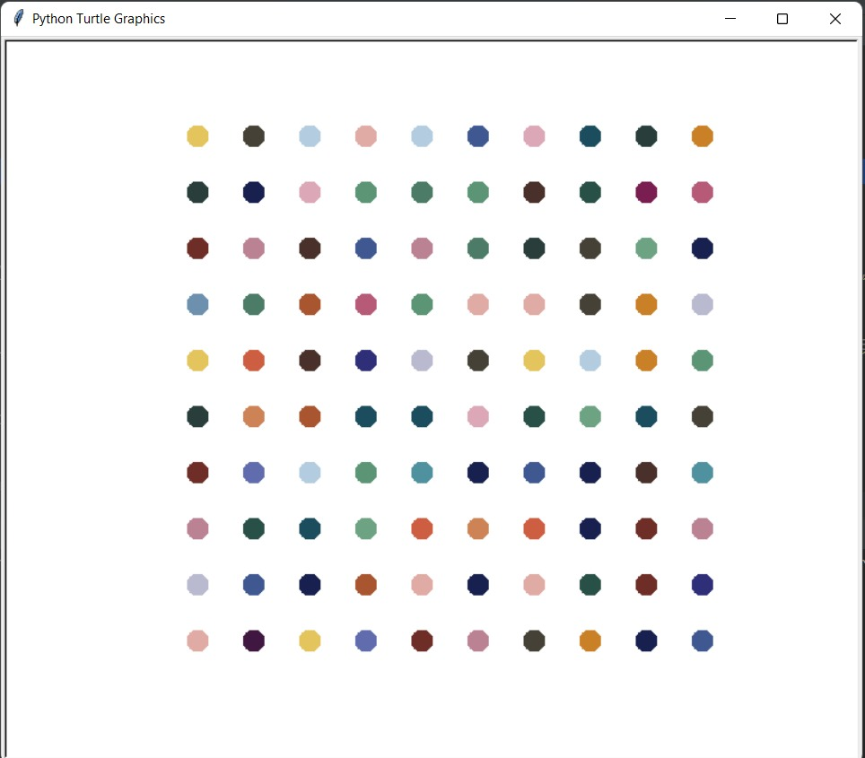
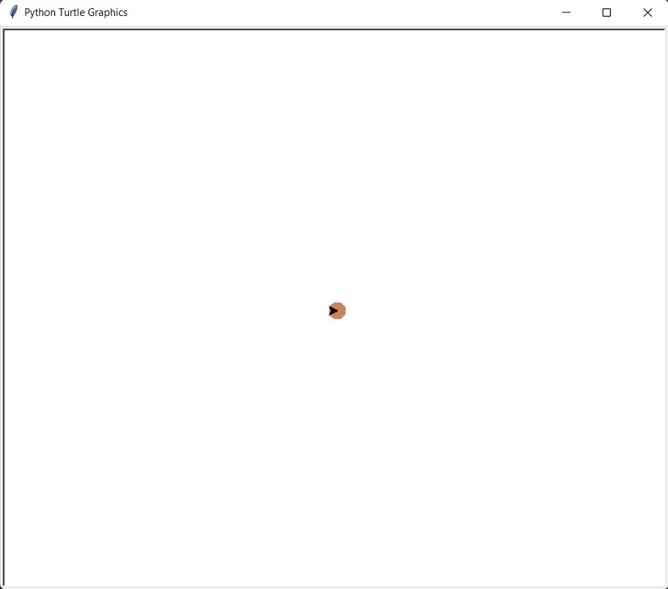
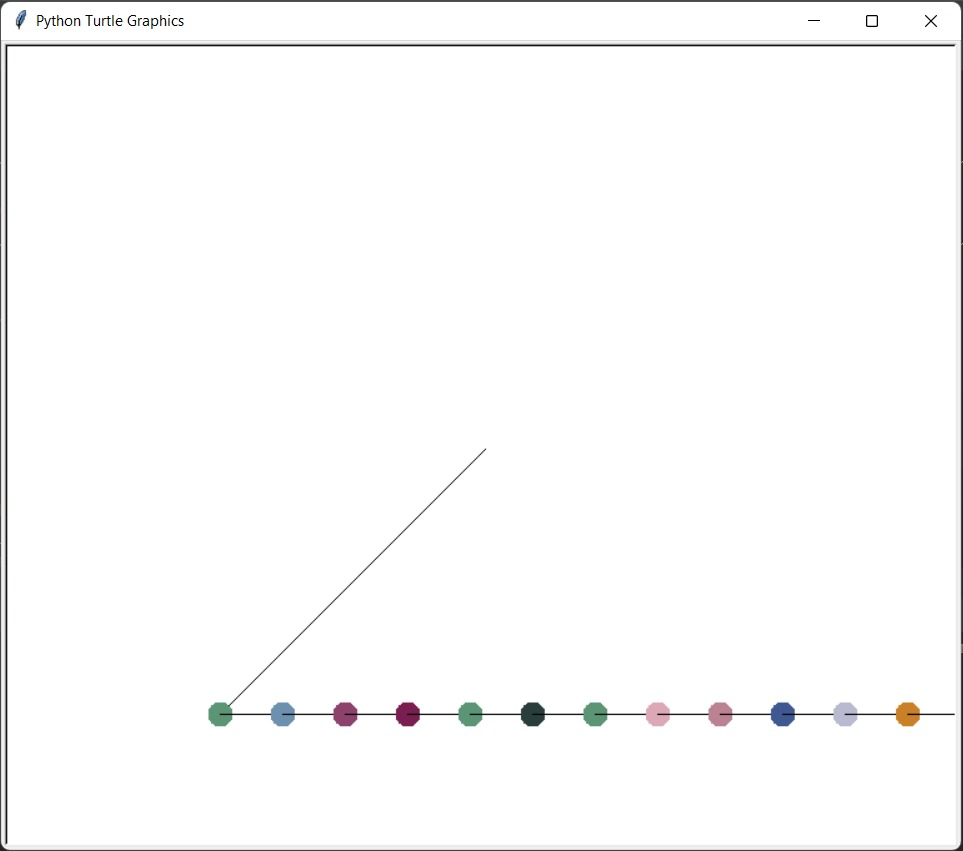
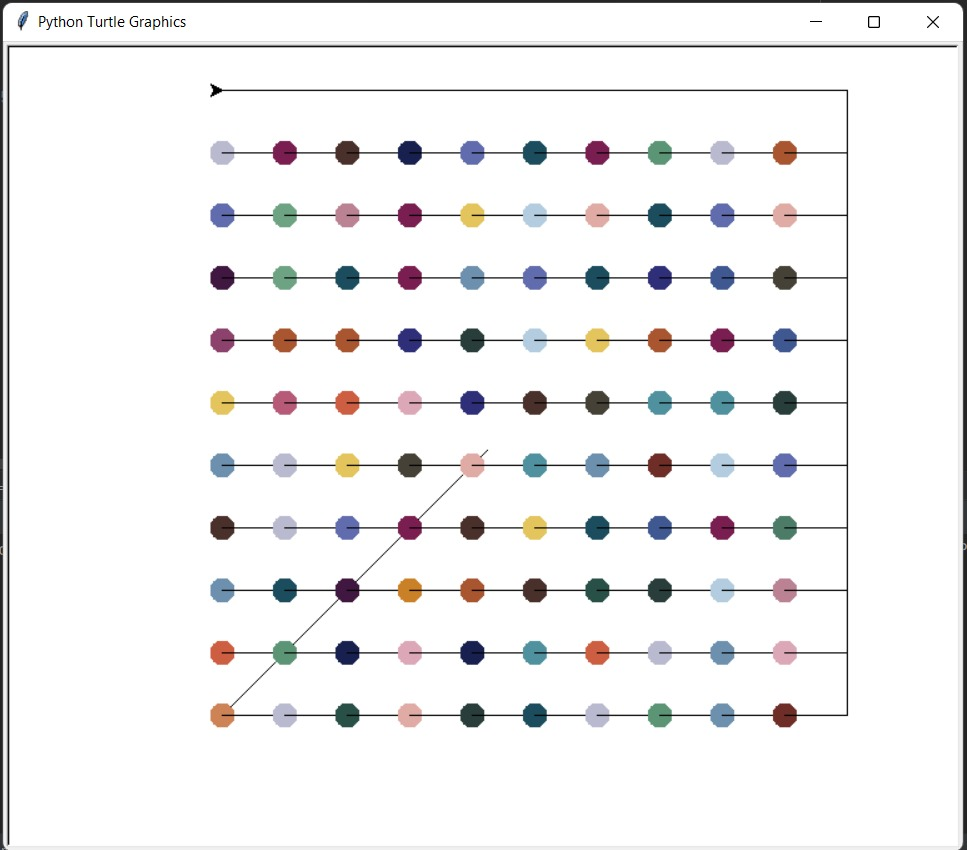
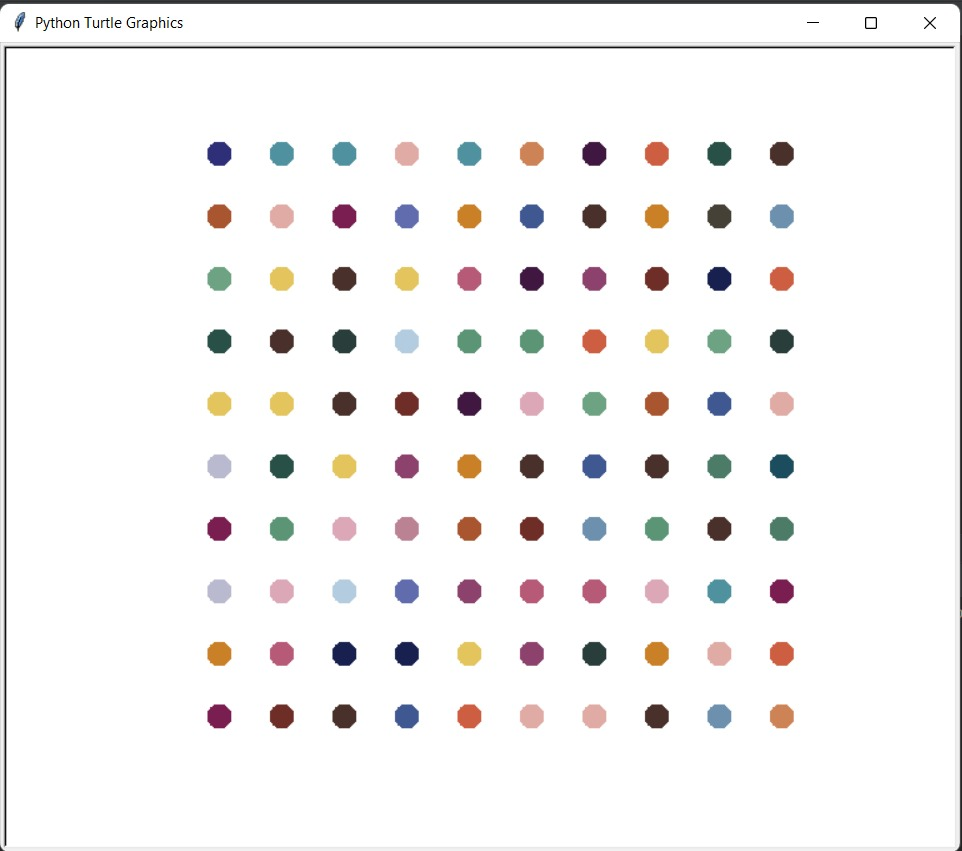

# The Hirst Painting Project

<h1>The Hirst Painting Project  🎨 🖌️</h1>

This is a recreation of <a href="https://en.wikipedia.org/wiki/Damien_Hirst">Damien Hirst's</a> <b>Spot Painting</b> using Python with the help of the Turtle module.

<h2>What are we upto ?🤔</h2>

We are going to create this colourful piece of art which sold for more than half a million pounds (100 random colored dots ) just by using the well-known turtle module present in the python library.

<h2>Prerequisites 🖍️</h2>
- Familiar with the <a href="https://docs.python.org/3/library/turtle.html#turtle.dot"> Turtle module</a> (Don't know? Internet is the savior. Trust me it's easy 😉). 
- Installation of the <a href="https://pypi.org/project/colorgram.py/">Colorgram Package</a>  (We need to make our painting as colorful as Damien Hirst's 🌈). 
- Basic comprehension of the <a href="https://en.wikipedia.org/wiki/RGB_color_model">RGB color system</a> 🧮.
<h2>Let's Paint ! </h2>
<h3>Task - 1 🖌️:</h3>
- We start by downloading a spot painting image, which we use to extract the colors using the colorgram package. 
- We run a for loop that taps into each of the colors, and extracts the red(r), green(g) and blue(b) colors. 
- Further we initiate a tuple that holds (r, g, b) and append the tuples into an empty list. 
- Lastly, we copy & paste the entire output list into our <b>main.py</b> and comment out the prior code (we don't need to run the computation every single time when our goal is to just extract the colors).
<h4>Beware of the Whites ! ⚪</h4>

Now while we are using our color_list, there are chances that the first few tuples lead to white (the background color from the image), which might be unnecessary.We can go ahead and <a href="https://www.w3schools.com/colors/colors_rgb.asp">test</a> our color tuples & remove the desired.

<h3>Task - 2 🖌️:</h3>
-  We intend on drawing a spot painting 10 X 10 in size, with each dot of size 20 and spaced apart by 50 paces. 
-  We use the dot() to draw the dots and colormode(255) to access and generate random RGB colors. 
 

- Inorder to prevent the turtle to start from the center and move out of the frame, we play around with setheading() & forward() to move the turtle to the intended position. 

- We then add more codes to the for loop to make the turtle move to the next row and start from the front & keep moving further drawing dots. 

 
- Lastly, we can increase the speed of our turtle by using speed(), make the forward lines vanish by using penup() (this doesn't affect our dots!) and make the turtle invisible by using hideturtle(). 

 
<h4 align="center">Hooray, our painting is ready !</h4>
<h2>Things we learnt 🕮️</h2>
- How amazing the turtle module is! 🐢 
- How expensive contemporary art can be! 😝
<h3>Thanks for Visiting!</h3>
